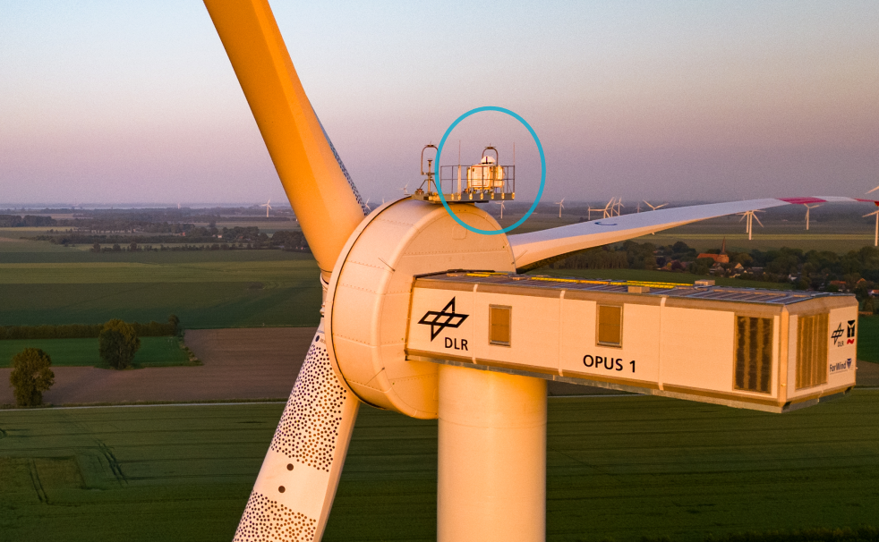
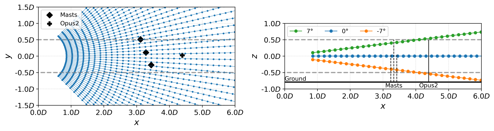
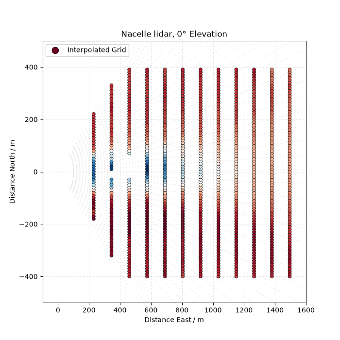
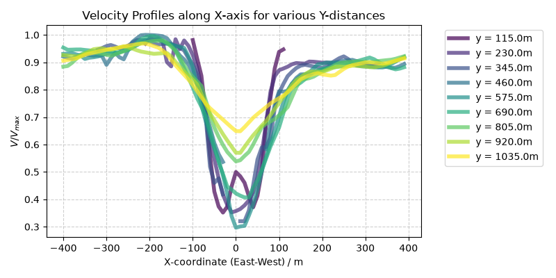

**LiDAR wake measurements from OPUS1**  
=================================================

A wind Doppler lidar is mounted on the nacelle of **OPUS 1** at ~95 m height and provides wind‑velocity measurements for validating models. Turbulence can be derived as well.

* **Type of lidar:** Leosphere *Windcube 200S*  

The lidar performs **plan‑position‑indicator (PPI)** scans in the wake of OPUS 1 and, for specific wind sectors (westerly flow), OPUS 2 wakes are measured as well.

Long‑term measurement strategy
------------------------------

.. list-table::
   :header-rows: 1
   :widths: 50 50

   * - Parameter
     - Value
   * - elevation
     - -7°, 0°, 7°
   * - azimuth
     - -45° to 45°
   * - azimuth angular resolution
     - 2°
   * - range
     - 100 m to 4080 m
   * - range gate distance
     - 20 m
   * - physical resolution
     - 50 m
   * - accumulation time
     - 200 ms
   * - single‑elevation scan duration
     - 7 s
   * - scan repetition rate
     - ~27 s

Details about the long-term lidar scanning strategy and results of wake parameter analyses can be found here:

Menken, J. and Wildmann, N.: Impact of atmospheric stability and turbulence on wind turbine wake characteristics: a nacelle lidar study, Wind Energ. Sci., 11, 2783–2800, https://doi.org/10.5194/wes-11-2783-2026, 2026. 

.. Campaign measurement strategy
.. -----------------------------

.. * **2025‑03:** elevations changed to –14°, –7°, 0°, 7°, 14°  
.. * **2026‑03:** only 0° elevation scans during daytime and –7°, 0°, 7° scans during nighttime  

Data processing
----------------

- CNR filtering and median filtering on removes hard target errors due to masts and wind turbine as well as low signal noise and second-echo ambiguities.
- Correction for detected azimuth offset between lidar and wind turbine (important for correct yaw misalignment and wake deflection evaluation)
- Cosine-projection of horizontal velocities from line‑of‑sight velocities, assuming that yaw mis‑alignment is negligible and the wind turbine is aligned with the mean wind direction. 
- Time-averaging on a polar grid for the observation period.
- Interpolating from polar to rectilinear grid relative to turbine origin  

**Output:** horizontal velocities in the wake on an *x‑y* grid in turbine‑relative coordinates  

Example
~~~~~~~

| Data is provided after completion of the benchmark submissions.

.. NetCDF structure
.. ~~~~~~~~~~~~~~~~

.. :: 

..     root group (NETCDF4 data model, file format HDF5):
..         title: LiDAR PPI cross‑sections
..         institution: DLR e.V.
..         source: Windcube 200S-85
..         history: 2026‑02‑22: Gridded using scipy.griddata and linear interpolation
..         dimensions(sizes): row(14), col(80)
..         variables(dimensions):
..             float64 v_los(row, col)
..             int32   x_grid(row, col)
..             int32   y_grid(row, col)
..             float64 v_h_reconstructed(row, col)

..     Variables:

..     float64 v_los(row, col)
..         _FillValue: nan
..         units: m s⁻¹
..         long_name: Radial Velocity
..         coordinates: x_grid y_grid
..         unlimited dimensions:
..         current shape = (14, 80)

..     int32 x_grid(row, col)
..         units: m
..         long_name: X‑distance in LiDAR‑fixed frame
..         unlimited dimensions:
..         current shape = (14, 80)

..     int32 y_grid(row, col)
..         units: m
..         long_name: Y‑distance in LiDAR‑fixed frame
..         unlimited dimensions:
..         current shape = (14, 80)

..     float64 v_h_reconstructed(row, col)
..         _FillValue: nan
..         units: m s⁻¹
..         long_name: Reconstructed Horizontal Wind
..         coordinates: x_grid y_grid
..         unlimited dimensions:
..         current shape = (14, 80)
