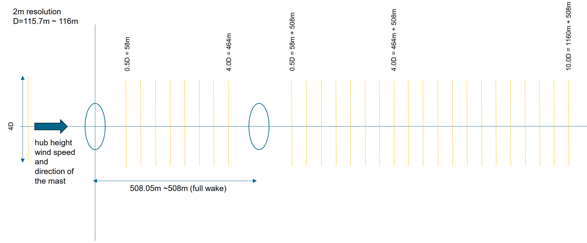
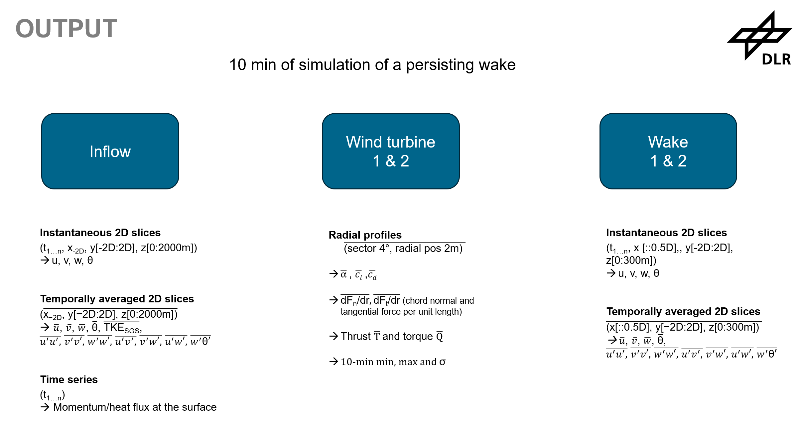

Modeling Instructions
=====================

Workflow LES modeling (same for each phase):

- LES Domain layout: the participants are free to choose the resolution and domain size which they assume as suitable for their individual setup and fluid solver, as long as the requirements for the output files can be fulfilled (see :doc:`submissions`)
- Modeling of the wind turbine: the necessary files for the ADM or ALM-LES setup of the scaled NREL 5 MW turbine are given in input/turbine_model. A description of these files is given :ref:`below <turbine>`.
- Coordinate system for the output files:

- Format of the output files:
    - 10 Minute average of a persisting wake

.. _turbine:

Turbine models for simulations
------------------------------

(todo: other turbine model settings for pywake etc.)

NREL-5MW for ADM/ALM-LES
~~~~~~~~~~~~~~~~~~~~~~~~

**NREL5MW.vel** (todo: click name to get to  file)

This file contains velocity dependent information (cutin and cutout wind speed)

- The first column is the wind speed in m/s.
- The second column is the rpm related to the corresponding wind speed.
- The third column is the pitch angle related to the corresponding wind speed.

--------------------------------------

**scaled_NREL5MW.geo**

This files contains Information of

- r/R scaled radial positions along the blade, dimensionless
- dr/R scaled element length, dimensionless
- Twist angle in degree
- c/R scaled chord length, dimensionless
- t/c thickness/chord, dimensionless
- t/R scaled thickness, dimensionless

-------------------------------------

**NREL5MW.cl**

- first row:
	- 0 can be ignored
	- rest: r/R scaled radial positions along the blade, dimensionless
	- The corresponding airfoil starts at the value of r/R and is valid until the next value of r/R in the next column is reached.
	- The Cylinder1 starts at r/R=0.023810336 (1.5m for the NREL 5MW = radius hub) and is valid for all radial positions r/R < 0.11058183.
	- For the final NACA64 airfoil, it is valid from 0.67470371 - 1.
	- The table below is for the NREL 5MW and listed here for reference of the r/R values.		

.. list-table::
   :widths: 30 40 30
   :header-rows: 1

   * - airfoil
     - active [m]
     - r/R
   * - Cylinder1
     - 1.500 – 6.967
     - 0.023810
   * - Cylinder2
     - 6.967 – 9.700
     - 0.110582
   * - DU40
     - 9.700 – 13.800
     - 0.153968
   * - DU35
     - 13.800 – 22.000
     - 0.219048
   * - DU30
     - 22.000 – 26.100
     - 0.349206
   * - DU25
     - 26.100 – 34.300
     - 0.414286
   * - DU21
     - 34.300 – 42.500
     - 0.544444
   * - NACA64
     - 42.500 – 63.000
     - 0.674603

- first column: angle of attack in Degree

- other columns: cl for the corresponding r/R position and the corresponding angle of attack

-------------------------------------

**NREL5MW.cd**

same as NREL5MW.cl, the other columns represent now the cd values