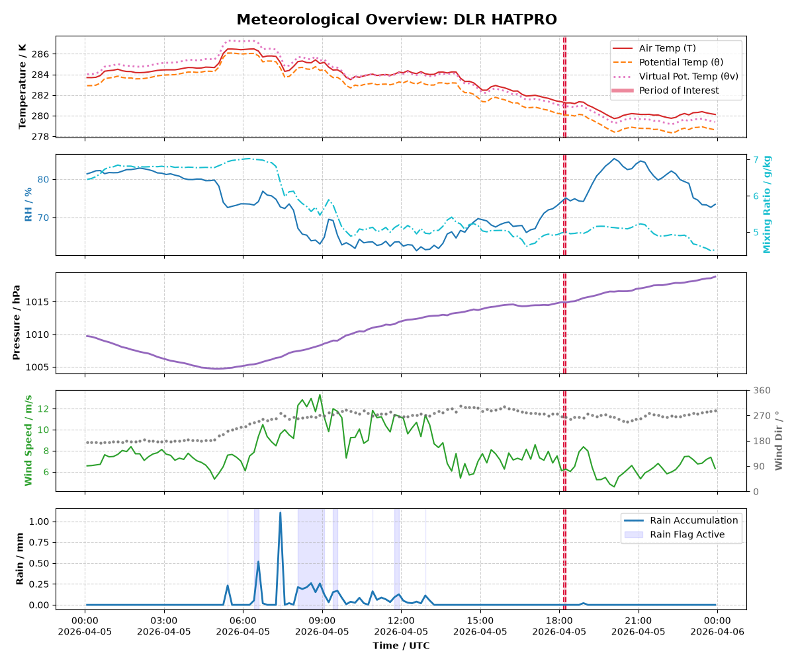
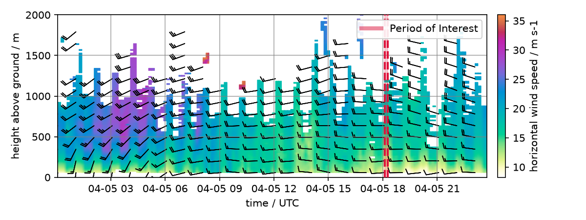
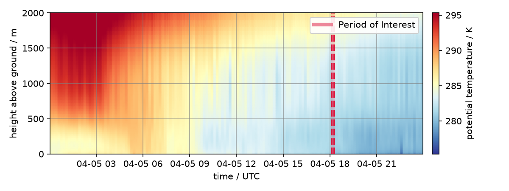
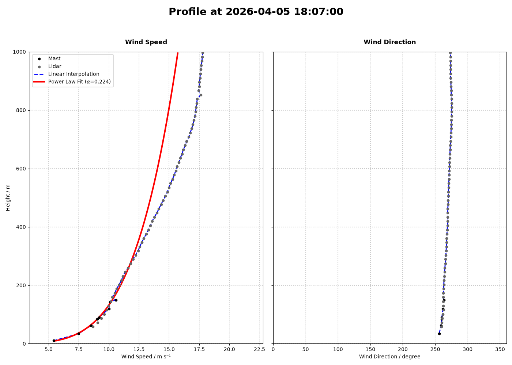
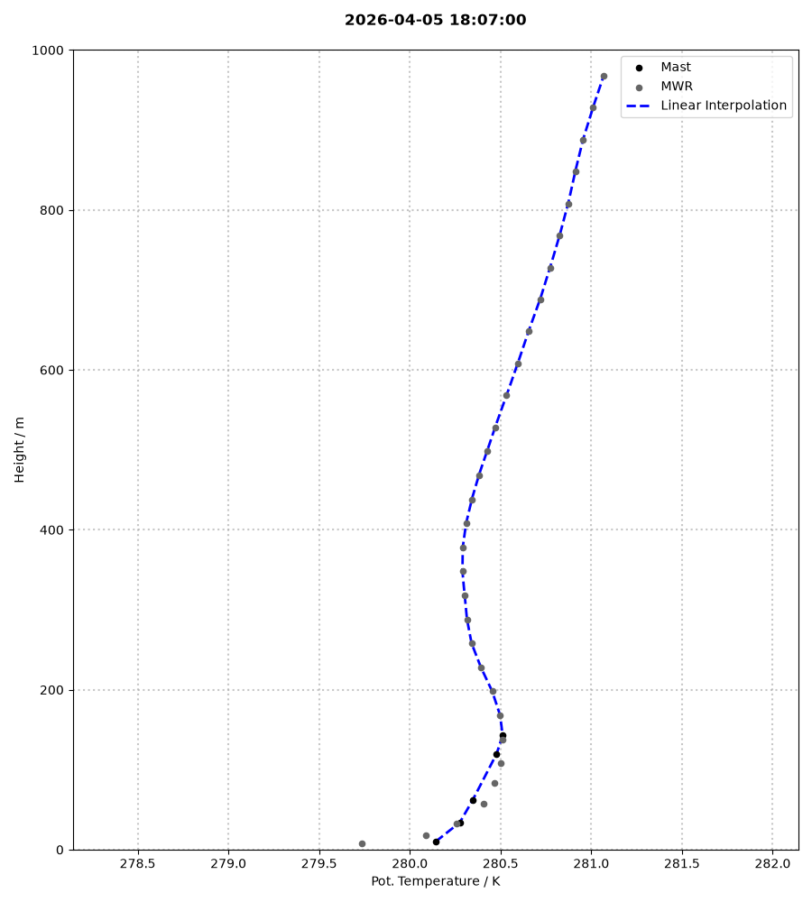
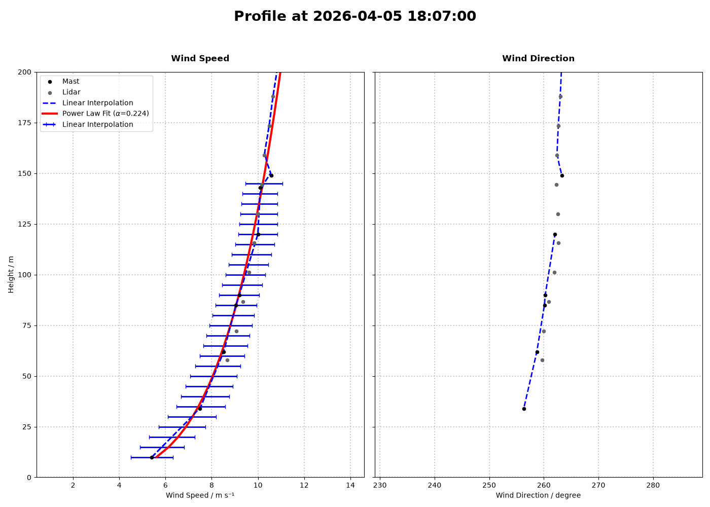

Benchmark test dataset
======================

For benchmark phase I, we are using a situation with near-ideal alignment of both wind turbines, partial load wind conditions and a near-neutral ABL stratification.
As a test dataset we chose the period 18:07 -- 18:17 UTC on 5th April 2026. 

The following meteorological conditions are observed at hub height in the inflow (IEC+mast, 2D upstream):

.. list-table::
   :widths: 50 50
   :header-rows: 1

   * - Parameter
     - Value
   * - U
     - 9.2 m/s
   * - Ψ
     - 260.3°
   * - TI
     - 9.5 %
   * - α
     - 0.22
   * - dθ
     - 0.22 K / 100 m

Meteorological situation
------------------------

Diurnal evolution 
^^^^^^^^^^^^^^^^^

Near-surface evolution: the 2-m values for temperature, humidity, pressure, and wind speed and direction are given at the location of the microwave radiometer. Since this is not in the inflow, the wind measurements should not be used to derive information about the inflow. Cooling rate, air density as well as rain rates and humidity are however representative of the site. We provide data for the day before and the day of the period of interest. The data is provided in the file 20260405_1810_ground_met.nc

Wind profile time-height plot

Temperature profile time-height plot

Vertical profiles 
^^^^^^^^^^^^^^^^^
We zoom into a 10-minute period from 18:07--18:17 UTC, as indicated with the red vertical lines in the plots above. To obtain a single, continuous profile from 10 m height above ground up to the ABL height, we merge IEC+ mast data and remote sensing. Up to 150 m, the in situ mast data is used and above the remote sensing data is used. All data is finally interpolated to a 2-m vertical resolution. Turbulence intensity is only given for the in situ measurements up to 150 m. The data can be found in the file 20260405_1810_interpolated_profiles.nc. 

Wind profile

Virtual potential temperature profile

Zoom to rotor layer and turbulence
~~~~~~~~~~~~~~~~~~~~~~~~~~~~~~~~~~

Wind profile up to 200 m height. The error bars show the standard deviation of wind speed and the red line a power law fit to the profile between 10 m and 200 m.

