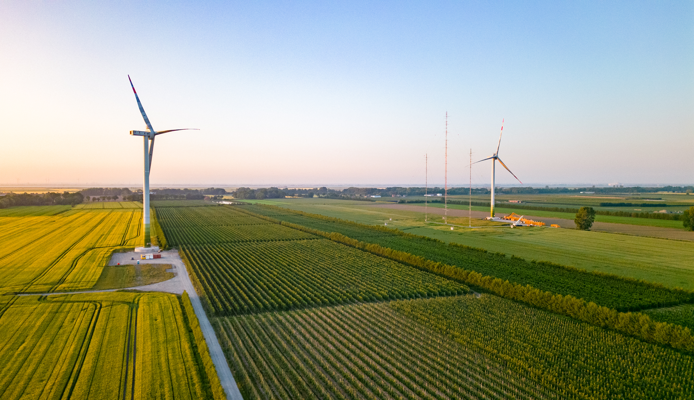
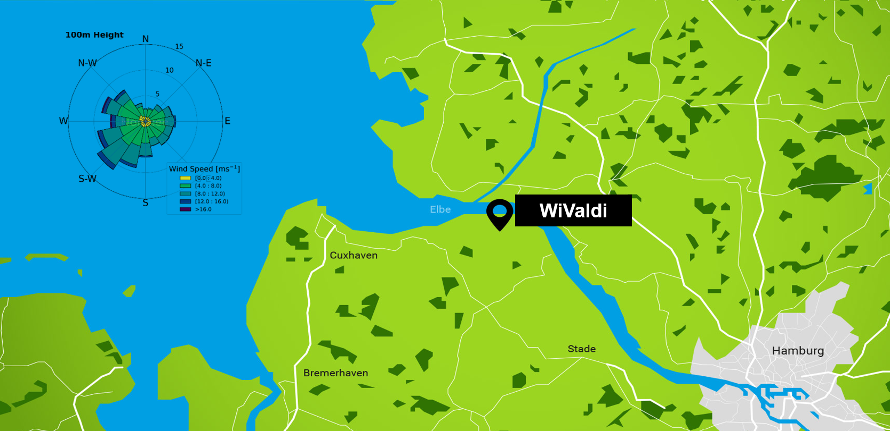
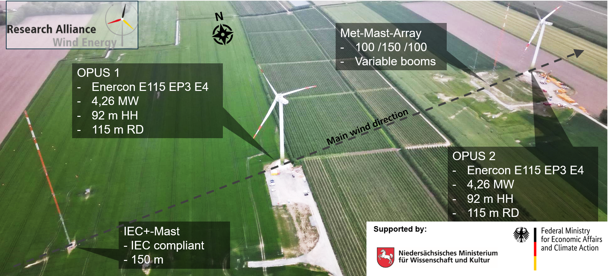
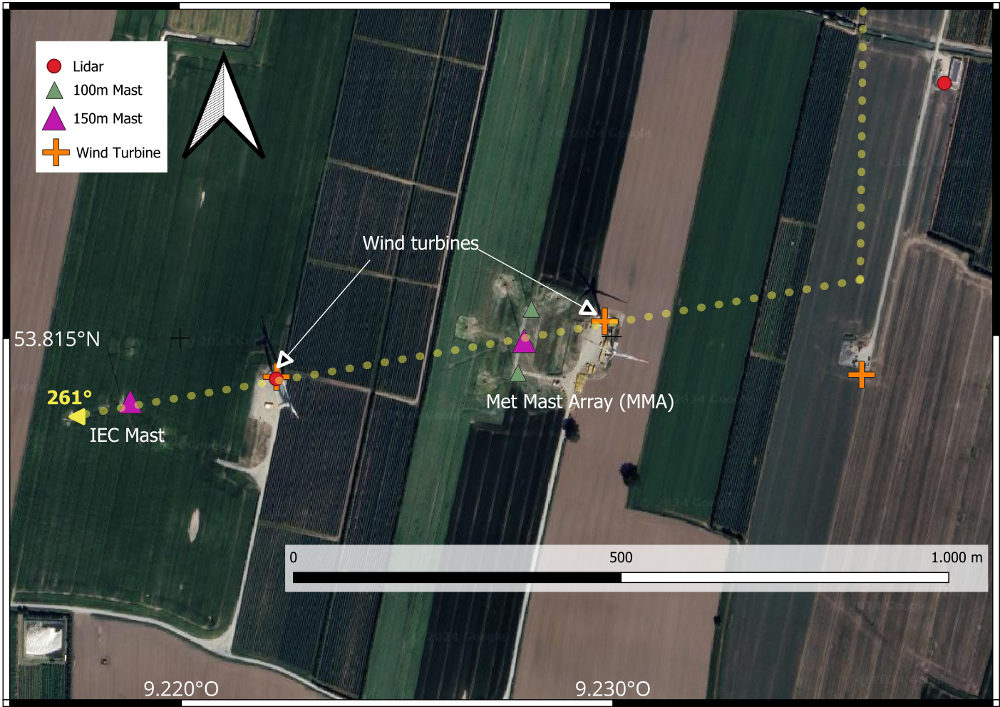
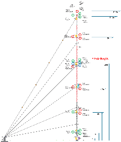
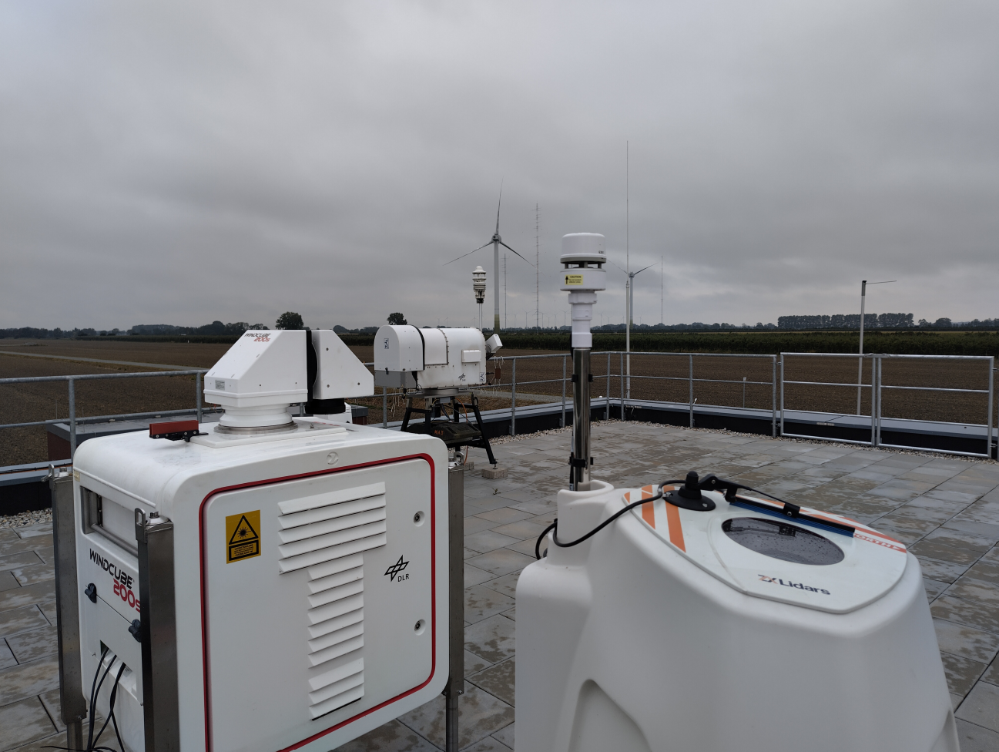

The Krummendeich Research Wind Farm WiValdi
=====================

DLR is developing the wind energy research farm at its Krummendeich site in Lower Saxony together with partners from the Research Alliance Wind Energy​​​​​​​. 
The research wind farm is designed for long-term research and, in addition to two conventional wind turbines, it will also include 
a smaller experimental facility as well as meteorological measurement masts and experimental measurement technologies. 

A general description of the WiValdi test site can be found here:

- https://windenergy-researchfarm.com/en

Layout and Coordinates
-----------
The site ist located in Northern Germany, approximately 50 km north-west of Hamburg 
and 35 km south-east of the North-Sea coast, in close vicinity to the river Elbe.

The site features two Enercon E115 EP3 E4 wind turbines called OPUS1 and OPUS2, a 150 m meteorological mast (aka IEC+ mast) in the inflow and a mast array (aka MMA) between the turbines. 

The turbines are aligned in main wind direction, which is from South-West (approx. 261°).

The turbines are approximately 4.5 rotor diameters (i.e. ~505 m) separated.
The exact absolute and relative coordinates of the wind turbines and the masts are given in the table below:

.. list-table::
   :widths: 15 10 10 15 15 15 15 10 10
   :header-rows: 1

   * - 
     - Latitude / deg
     - Longitude / deg
     - Gauß-Krüger (EPSG 31467) East / m
     - Gauß-Krüger (EPSG 31467) North / m
     - UTM Zone 32N Easting / m
     - UTM Zone 32N Northing / m
     - relative X to OPUS1 / m
     - relative Y to OPUS1 / m
   * - OPUS1
     - 53.796994
     - 9.220894
     - 514625.72
     - 5962902.99
     - 514549.82
     - 5960958.19
     - 0
     - 0
   * - OPUS2
     - 53.797741
     - 9.228500
     - 515126.67
     - 5962987.65
     - 515050.57
     - 5961042.80
     - 500.95
     - 84.66
   * - IEC (Inflow) mast
     - 53.796651
     - 9.217390
     - 514394.99
     - 5962864
     - 514319.18
     - 5960919.22
     - -230.73
     - -38.99
   * - MMA North mast
     - 53.797915
     - 9.226804
     - 515014.83
     - 5963006.64
     - 514938.78
     - 5961061.79
     - 389.11
     - 103.65
   * - MMA Center mast
     - 53.797477
     - 9.226631
     - 515003.61
     - 5962957.91
     - 514927.56
     - 5961013.08
     - 377.89
     - 54.92
   * - MMA South mast
     - 53.797036
     - 9.226488
     - 514994.33
     - 5962908.73
     - 514918.28
     - 5960963.92
     - 368.61
     - 5.74
   * - Ground lidar
     - 53.818487
     - 9.237587
     - 515717.65
     - 5965298.71
     - 515641.38
     - 5963352.92
     - 1091.93
     - 2395.72
   * - MWR
     - 53.818512
     - 9.237934
     - 515740.49
     - 5965301.57
     - 515664.21
     - 5963355.78
     - 1114.77
     - 2398.58

The wind turbines
---------------------------
The two wind turbines OPUS1 and OPUS2 have the following basic characteristics:

.. list-table::
   :widths: 50 50
   :header-rows: 1

   * - Parameter
     - Value
   * - type
     - E-115 EP3 E4
   * - hub height
     - 92 m
   * - rotor diameter
     - 115.7 m
   * - rated power
     - 4.26 MW
   * - cut-in wind speed
     - 2.5 m/s
   * - rated wind speed
     - 13 m/s
   * - cut-out wind speed
     - 34 m/s

Meteorological measurements
---------------------------

Within the benchmark, meteorological data from multiple data sources is used, i.e. in situ instrumentation on the IEC+ mast, remote sensing data by long-range Doppler wind lidar (DWL) and microwave radiometer (MWR), as well as ground station weather station data. 

IEC+ mast
^^^^^^^^^

Here, we list the wind an temperature sensors that are used in the benchmark dataset with their respective mounting height.

.. list-table::
   :widths: 25 50 25
   :header-rows: 1

   * - Sensor
     - Type
     - Height
   * - Ultrasonic Anemometer
     - Ultraschallanemometer METEK uSonic-3 Cage MP
     - 2x33 m, 3x62 m, 85 m, 3x120 m, 149 m
   * - Cup Anemometer
     - Schalensternanemometer Thies First Class Advanced X
     - 3x10 m, 33 m, 3x91 m, 142 m, 2x143 m
   * - Wind Vane
     - Windrichtungsgeber Thies First Class
     - 3x90 m
   * - Thermo-/ Hygrometer
     - Thermo-/Hygrogeber Vaisala HMP155
     - 1 m, 10 m, 34 m, 62 m, 89 m, 120 m, 143 m
   * - Thermo-/ Hygrometer
     - Thies Hygro-Thermogeber-compact
     - 85 m
   * - Pressure Sensor
     - Drucksensor Vaisala PTB330
     - 10 m
   * - Pressure Sensor
     - Thies Barogeber
     - 85 m
   * - Precipitation Sensor
     - Thies Niederschlagssensor
     - 8 m
   * - Gas Analyzer
     - Gasanalysator Licor LI-7500A
     - 61 m
   * - Diff. Temperature Sensor
     - Temperaturdifferenzsensor Bauart Risoe P1867
     - 62 m

Wind lidar and Microwave radiometer profiling
^^^^^^^^^^^^^^^^^^^^^^^^^^^^^^^^^

A Doppler wind lidar and a microwave radiometer (MWR) were installed next to or on top of the Leitwarte (North-East of OPUS2) since 2020. The instruments provide vertical profiles of 3D wind, turbulence temperature and humidity throughout the ABL. 
Details about the measurement principle and data quality can be found here: 

Wildmann, Norman und Hagen, Martin und Gerz, Thomas (2022) Enhanced resource assessment and atmospheric monitoring of the research wind farm WiValdi. Journal of Physics: Conference Series, 2265 (2), 022029. Institute of Physics (IOP) Publishing. doi: 10.1088/1742-6596/2265/2/022029. ISSN 1742-6588. 

Nacelle-based lidar measurements
^^^^^^^^^^^^^^^^^^^^^^^^^^^^^^^^^

Details of the nacelle-based lidar measurements will be used for the validation of downstream (wake) flow and are described here:
:doc:`/lidar_wake`
